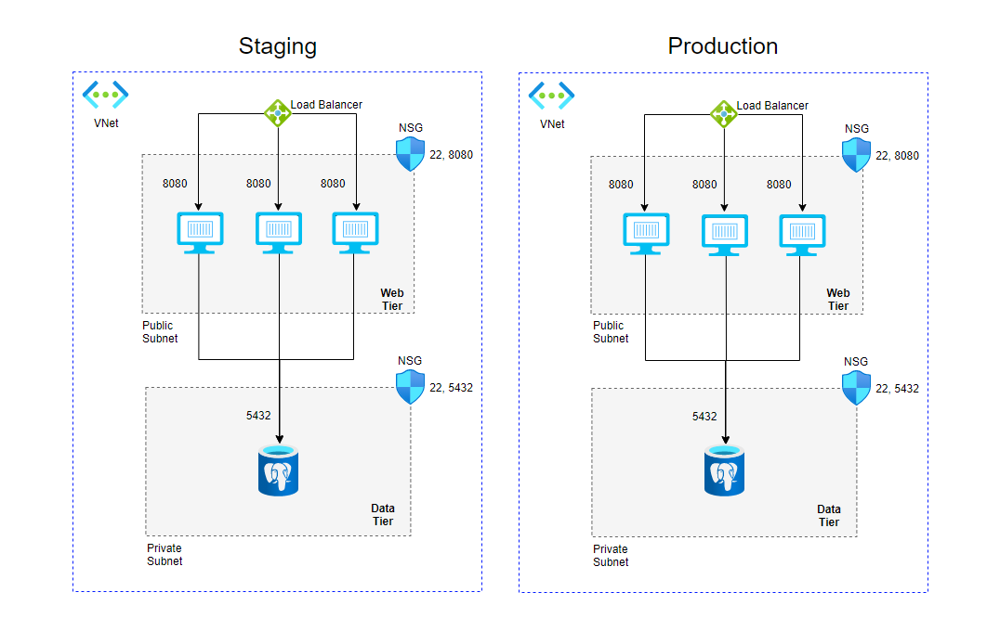

# Weight Tracker Infrastructure Docker

 This project shows how to create Infrastructure as code for the **Weight Tracker** app with **Terraform**.

The requested infrastructure:



## Configuration

1. Two virtual networks, private and public networks.
3. Create 3 virtual machines and add them to the availability set and load balancer
4. Add NSG to public subnet and allow access only from port 8080 and SSH with a specific IP address
5. Add NSG to the private subnet and allow access only from the web app with port 5432.
6. Add PostgreSQL - Flexible Server
7. Restrict access to the server, allow connection only from the web server subnet 
7. Configure a terraform output, so the VM password can be retrieved during automation and set the output to sensitive.
8. Use the command: **terraform output  -json**  to retrieve the VMs password.
9. **Workspaces** are used for environment selection.

To select the environment:
```
terraform workspace select environment name
```
To apply infrastructure with the workspace variables:
```
terraform terraform apply -var-file="environmentName.tfvars"
```
9. Environment **tfvars** created for each environment.

8. Install the WeightTracker application and the Database into the VMs created by Terraform.

10. Add **Private Azure DevOps Agent** VM for each environment
9. Add Terraform backend to store the Terraform state in Azure Blob Storage

## Modules:
* **network**       - module for networking resources
* **load_balancer** - module for load balancer resources
* **web_server**    - module for creating web servers
* **agent**         - module for creating agent VM for Azure DevOps
* **acr**           - module for adding private Azure DevOps Agent
* **postgres_db**   - module for adding Postgres managed database


<!-- BEGIN_TF_DOCS -->
## Requirements

| Name | Version |
|------|---------|
| <a name="requirement_terraform"></a> [terraform](#requirement\_terraform) | >=0.12 |
| <a name="requirement_azurerm"></a> [azurerm](#requirement\_azurerm) | ~>2.0 |

## Providers

| Name | Version |
|------|---------|
| <a name="provider_azurerm"></a> [azurerm](#provider\_azurerm) | 2.99.0 |
| <a name="provider_local"></a> [local](#provider\_local) | 2.2.3 |

## Modules

| Name | Source | Version |
|------|--------|---------|
| <a name="module_azure_devops_agents"></a> [azure\_devops\_agents](#module\_azure\_devops\_agents) | ./modules/agent | n/a |
| <a name="module_network"></a> [network](#module\_network) | ./modules/network | n/a |
| <a name="module_postgres_server"></a> [postgres\_server](#module\_postgres\_server) | ./modules/postgres_db | n/a |
| <a name="module_private_acr"></a> [private\_acr](#module\_private\_acr) | ./modules/acr | n/a |
| <a name="module_server_load_balancer"></a> [server\_load\_balancer](#module\_server\_load\_balancer) | ./modules/load_balancer | n/a |
| <a name="module_servers_cluster"></a> [servers\_cluster](#module\_servers\_cluster) | ./modules/web_server | n/a |

## Resources

| Name | Type |
|------|------|
| [azurerm_resource_group.rg](https://registry.terraform.io/providers/hashicorp/azurerm/latest/docs/resources/resource_group) | resource |
| [azurerm_resource_group.storage-rg](https://registry.terraform.io/providers/hashicorp/azurerm/latest/docs/resources/resource_group) | resource |
| [azurerm_storage_account.storage_account](https://registry.terraform.io/providers/hashicorp/azurerm/latest/docs/resources/storage_account) | resource |
| [azurerm_storage_container.tfstate](https://registry.terraform.io/providers/hashicorp/azurerm/latest/docs/resources/storage_container) | resource |
| [local_file.ansible_agent_host_vars](https://registry.terraform.io/providers/hashicorp/local/latest/docs/resources/file) | resource |
| [local_file.ansible_agent_inventory](https://registry.terraform.io/providers/hashicorp/local/latest/docs/resources/file) | resource |
| [local_file.ansible_agent_vars](https://registry.terraform.io/providers/hashicorp/local/latest/docs/resources/file) | resource |
| [local_file.webservers_group_vars](https://registry.terraform.io/providers/hashicorp/local/latest/docs/resources/file) | resource |

## Inputs

| Name | Description | Type | Default | Required |
|------|-------------|------|---------|:--------:|
| <a name="input_account_replication_type"></a> [account\_replication\_type](#input\_account\_replication\_type) | Account replication type | `string` | n/a | yes |
| <a name="input_acr_dns_zone_name"></a> [acr\_dns\_zone\_name](#input\_acr\_dns\_zone\_name) | Acr dns zone name | `string` | n/a | yes |
| <a name="input_acr_name"></a> [acr\_name](#input\_acr\_name) | Name of the ACR. | `string` | n/a | yes |
| <a name="input_acr_subnet_address_prefix"></a> [acr\_subnet\_address\_prefix](#input\_acr\_subnet\_address\_prefix) | Acr subnet address prefix | `string` | n/a | yes |
| <a name="input_acr_subnet_name"></a> [acr\_subnet\_name](#input\_acr\_subnet\_name) | Acr subnet name | `string` | n/a | yes |
| <a name="input_acr_vnet_address_space"></a> [acr\_vnet\_address\_space](#input\_acr\_vnet\_address\_space) | Acr vnet address space | `string` | n/a | yes |
| <a name="input_acr_vnet_name"></a> [acr\_vnet\_name](#input\_acr\_vnet\_name) | Acr vnet name | `string` | n/a | yes |
| <a name="input_agent_vm_name"></a> [agent\_vm\_name](#input\_agent\_vm\_name) | Name of the azure devops vm agent | `string` | n/a | yes |
| <a name="input_availability_set_name"></a> [availability\_set\_name](#input\_availability\_set\_name) | Name of availability set | `string` | n/a | yes |
| <a name="input_container_reg_pass"></a> [container\_reg\_pass](#input\_container\_reg\_pass) | Azure container registry password | `any` | n/a | yes |
| <a name="input_container_reg_usr"></a> [container\_reg\_usr](#input\_container\_reg\_usr) | Azure container registry username | `any` | n/a | yes |
| <a name="input_db_name"></a> [db\_name](#input\_db\_name) | The name of postgres data base | `any` | n/a | yes |
| <a name="input_endpoint_name"></a> [endpoint\_name](#input\_endpoint\_name) | ACR endpoint name | `string` | n/a | yes |
| <a name="input_endpoint_network_interface_name"></a> [endpoint\_network\_interface\_name](#input\_endpoint\_network\_interface\_name) | ACR endpoint network interface name | `string` | n/a | yes |
| <a name="input_host_ip_address"></a> [host\_ip\_address](#input\_host\_ip\_address) | host ip address to allow for ssh firewall rule,set in variables.tfvars for security reasons. | `string` | n/a | yes |
| <a name="input_okta_client_id"></a> [okta\_client\_id](#input\_okta\_client\_id) | The client id for okta auth | `any` | n/a | yes |
| <a name="input_okta_secret"></a> [okta\_secret](#input\_okta\_secret) | The okta secret | `any` | n/a | yes |
| <a name="input_okta_url"></a> [okta\_url](#input\_okta\_url) | The the url for okta auth | `any` | n/a | yes |
| <a name="input_postgres_firewall_rule_end_ip"></a> [postgres\_firewall\_rule\_end\_ip](#input\_postgres\_firewall\_rule\_end\_ip) | The end ip address when allowing access to postgres through postgres firewall | `any` | n/a | yes |
| <a name="input_postgres_firewall_rule_start_ip"></a> [postgres\_firewall\_rule\_start\_ip](#input\_postgres\_firewall\_rule\_start\_ip) | The start ip address when allowing access to postgres through postgres firewall | `any` | n/a | yes |
| <a name="input_postgres_password"></a> [postgres\_password](#input\_postgres\_password) | postgres password set in variables.tfvars for security reasons. | `any` | n/a | yes |
| <a name="input_postgres_username"></a> [postgres\_username](#input\_postgres\_username) | postgres username set in variables.tfvars for security reasons. | `any` | n/a | yes |
| <a name="input_private-subnet-ngs_name"></a> [private-subnet-ngs\_name](#input\_private-subnet-ngs\_name) | Name of private subnet NSG | `string` | n/a | yes |
| <a name="input_private_dns_a_record_zone_name"></a> [private\_dns\_a\_record\_zone\_name](#input\_private\_dns\_a\_record\_zone\_name) | Acr private dns A record zone name | `string` | n/a | yes |
| <a name="input_private_subnet_name"></a> [private\_subnet\_name](#input\_private\_subnet\_name) | Private subnet name. | `string` | n/a | yes |
| <a name="input_private_subnet_prefix"></a> [private\_subnet\_prefix](#input\_private\_subnet\_prefix) | Set a prefix for private subnet | `any` | n/a | yes |
| <a name="input_public-subnet-ngs_name"></a> [public-subnet-ngs\_name](#input\_public-subnet-ngs\_name) | Name of public subnet NSG | `string` | n/a | yes |
| <a name="input_public_subnet_name"></a> [public\_subnet\_name](#input\_public\_subnet\_name) | Public subnet name. | `string` | n/a | yes |
| <a name="input_public_subnet_prefix"></a> [public\_subnet\_prefix](#input\_public\_subnet\_prefix) | Set a prefix for public subnet | `any` | n/a | yes |
| <a name="input_resource_group_location"></a> [resource\_group\_location](#input\_resource\_group\_location) | Location of the resource group. | `string` | n/a | yes |
| <a name="input_resource_group_name"></a> [resource\_group\_name](#input\_resource\_group\_name) | name of the resource group. | `string` | n/a | yes |
| <a name="input_server_count"></a> [server\_count](#input\_server\_count) | How many Servers to create. | `number` | n/a | yes |
| <a name="input_storage_account_key"></a> [storage\_account\_key](#input\_storage\_account\_key) | key is stored in variables.tfvars for security reasons. | `string` | n/a | yes |
| <a name="input_storage_account_name"></a> [storage\_account\_name](#input\_storage\_account\_name) | Name of the storage account | `string` | n/a | yes |
| <a name="input_storage_account_tier"></a> [storage\_account\_tier](#input\_storage\_account\_tier) | Tier of the storage account | `string` | n/a | yes |
| <a name="input_storage_container_access_type"></a> [storage\_container\_access\_type](#input\_storage\_container\_access\_type) | Access type of the storage container | `string` | n/a | yes |
| <a name="input_storage_container_name"></a> [storage\_container\_name](#input\_storage\_container\_name) | Name of the storage container | `string` | n/a | yes |
| <a name="input_storage_rg_name"></a> [storage\_rg\_name](#input\_storage\_rg\_name) | name of the storage resource group. | `string` | n/a | yes |
| <a name="input_vnet_address_space"></a> [vnet\_address\_space](#input\_vnet\_address\_space) | Address space for a vnet | `any` | n/a | yes |
| <a name="input_vnet_name"></a> [vnet\_name](#input\_vnet\_name) | Vnet name. | `string` | n/a | yes |
| <a name="input_web_server_name"></a> [web\_server\_name](#input\_web\_server\_name) | Name of the web server | `string` | n/a | yes |
| <a name="input_webserver_password"></a> [webserver\_password](#input\_webserver\_password) | Admin password set in variables.tfvars for security reasons. | `any` | n/a | yes |
| <a name="input_webserver_username"></a> [webserver\_username](#input\_webserver\_username) | Admin username set in variables.tfvars for security reasons. | `any` | n/a | yes |

## Outputs

| Name | Description |
|------|-------------|
| <a name="output_vms_password"></a> [vms\_password](#output\_vms\_password) | Use command - (terraform output  -json) to retrieve VMs password. |
<!-- END_TF_DOCS -->


